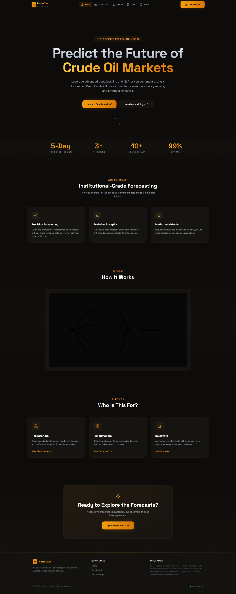

# FYP Frontend


A React TypeScript project built with Vite.

## Repository Status


---

## 📸 Preview

**Hero**


---

## Tech Stack

- **React 18+** - UI library
- **TypeScript** - Type safety
- **Vite** - Build tool and dev server
- **React Router** - Client-side routing

## Getting Started

### Prerequisites

- Node.js (v18 or higher recommended)
- npm or yarn

### Installation

Dependencies are already installed. If you need to reinstall:

```bash
npm install
```

### Development

Start the development server:

```bash
npm run dev
```

The app will be available at `http://localhost:5173`

### Build

Create a production build:

```bash
npm run build
```

### Preview

Preview the production build locally:

```bash
npm run preview
```

## Project Structure

```
fyp_frontend/
├── src/
│   ├── components/      # React components
│   │   ├── Home.tsx
│   │   └── About.tsx
│   ├── App.tsx          # Main App component with routing
│   ├── App.css          # App styles
│   ├── main.tsx         # Application entry point
│   ├── index.css        # Global styles
│   └── vite-env.d.ts    # Vite type definitions
├── index.html           # HTML entry point
├── package.json         # Dependencies and scripts
├── tsconfig.json        # TypeScript configuration
├── tsconfig.node.json   # TypeScript config for Vite
└── vite.config.ts       # Vite configuration
```

## Features

- ✅ React 18+ with TypeScript
- ✅ Vite for fast development and optimized builds
- ✅ React Router for client-side routing
- ✅ Hot Module Replacement (HMR)
- ✅ ESLint configuration
- ✅ TypeScript strict mode

## Available Scripts

- `npm run dev` - Start development server
- `npm run build` - Build for production
- `npm run preview` - Preview production build
- `npm run lint` - Run ESLint

## Learn More

- [React Documentation](https://react.dev/)
- [TypeScript Documentation](https://www.typescriptlang.org/)
- [Vite Documentation](https://vitejs.dev/)
- [React Router Documentation](https://reactrouter.com/)
